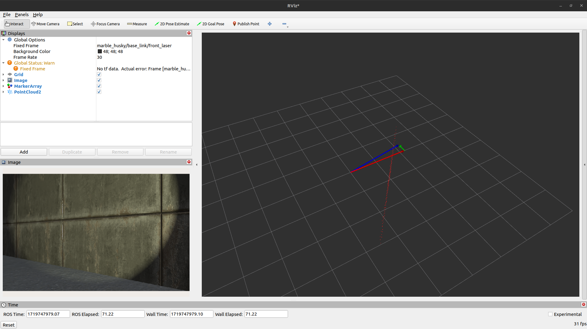
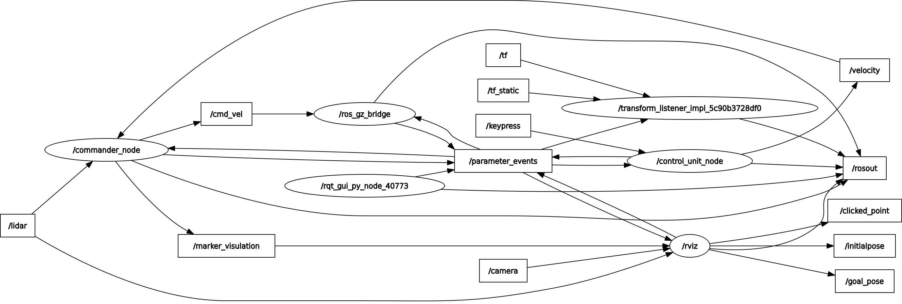

# Vehicle Control Software

**NOTE:** You can find the most up-to-date information on the [wiki](https://github.com/serkanMzlm/Vehicle-Control-Sotfware/wiki) page

---

### Project

This repository contains software written for ground vehicle control. The software is prepared for use both in the Gazebo simulation environment and in a real vehicle. In general, ROS2 Humble is used for communication between packages and with the simulation environment.

### Features:
- Gazebo Simulation Environment: The software is designed to run in the Gazebo simulation environment.
- Real Vehicle Support: The software is optimized for use in a real ground vehicle.
- Obstacle Avoidance: The vehicle adjusts its progress according to objects and performs obstacle avoidance.
- Future Developments: More complex software, such as artificial intelligence and image processing, will be added in future stages.


**Gazebo Garden:** Simulation settings can be modified by assigning the topic name lidar for the lidar window to display Lidar data. If it is desired to hide areas where detection is not performed, unchecking the show non-hitting rays option is recommended


---

**Rviz2:** The Lidar sensor data is visualized in conjunction with the camera at the front of the vehicle, as well as the data from the joystick and the error information from obstacle avoidance.

- The **RED** arrow represents the linear velocity.
- The **GREEN** arrow represents the angular velocity.
- The **BLUE** arrow represents the result vector.



---

**RQT:** Using rqt, we can observe the relationships between packets



---

### System Requirements
**Note:** The code is based on the specifications of the computer on which it was written. With minor adjustments, it should work without issues on different versions as well. As an example, for those using ROS2 Foxy, the subscription functions need to be adjusted. In Foxy, subscription functions should be written as `function_type function_name(const data_type::SharedPtr msg)`. This requirement does not exist in Humble.

- OS: [Ubuntu 22.04 Jammy Jellyfish](https://releases.ubuntu.com/jammy/)
- Simulation Program: [Gazebo Garden](https://gazebosim.org/docs/garden/getstarted)
- ROS2: [Humble Hawksbill](https://docs.ros.org/en/humble/index.html)

### Install
- Set the directory where the project will be downloaded (for example, the home directory is used in this example).

```bash
cd ~
git clone git@github.com:serkanMzlm/Vehicle-Control-Sotfware.git --recursive

# A branch can be downloaded directly.
git clone git@github.com:serkanMzlm/Vehicle-Control-Sotfware.git -b [branch_name]

# --recursive is used to download additional modules.
git clone git@github.com:serkanMzlm/Vehicle-Control-Sotfware.git
```

### Compile
- The path to the model should be added to the GZ_SIM_RESOURCE_PAT environment variable
- In Gazebo, any change made to the world environment directly affects the system; there is no need to rebuild anything.
```bash
export GZ_SIM_RESOURCE_PATH=/home/${USER}/Vehicle-Control-Sotfware/Tools/simulation/models"
```
- The purpose of the code specified in the [drive_launch.py](https://github.com/serkanMzlm/Vehicle-Control-Sotfware/blob/main/src/modules/vehicle_control_software/launch/drive_launch.py#L16) file is to parse the data in GZ_SIM_RESOURCE_PATH to determine the environment in which the simulation will run and to locate the models. Therefore, ensure that 'GZ_SIM_RESOURCE_PATH' is correctly assigned.

```python
if gz_sim_resource_path:
    paths = gz_sim_resource_path.split(":")
    desired_path = None

    for path in paths:
        if "Vehicle-Control-Sotfware" in path:
            desired_path = path
            break
    
    if desired_path:
        directory = desired_path.split("/")
        sim_world_path = "/".join(directory[:-1])
        sim_world_file = simulation_world_path = Path(sim_world_path, "worlds", "land_vehicle.sdf")
        simulation = ExecuteProcess(cmd=["gz", "sim", "-r", sim_world_file])
    else:
        print("Vehicle-Control-Sotfware directory not found in GZ_SIM_RESOURCE_PATH.")
        simulation = ExecuteProcess(cmd=["gz", "sim"])
```

- Optionally, to have this command automatically executed every time a terminal is opened, it can be added to the `.bashrc` file.
- If you directly added it to the `.bashrc` file, run the `.bashrc` file once

```bash
echo "export GZ_SIM_RESOURCE_PATH=/home/${USER}/Vehicle-Control-Sotfware/Tools/simulation/models" >> ~/.bashrc 

source ~/.bashrc # or bash or simply restart the terminal
```
- When using the `bash` command to reload the terminal, it restarts the terminal session, while `source ~/.bashrc` reloads the .bashrc file, applying the changes for the current session

- Build the project.
    - First, build the packages located in src/include. For example, build and include the geometric_operations, num_tools, and time_utils packages in the system. We use these modules as libraries in the packages.
    
```bash
cd ~/Vehicle-Control-Sotfware
colcon build --packages-select geometric_operations num_tools time_utils
. install/setup.bash
```
```bash
#Builds all files in the project.
colcon build  
```

### Run
```bash
source /opt/ros/humble/setup.bash
source ~/Vehicle-Control-Sotfware/install/setup.bash
```

- To avoid entering the `source ~/Vehicle-Control-Sotfware/install/setup.bash` command every time a new terminal is opened, these commands are written to the `~/.bashrc` file.
```bash
echo "source /opt/ros/humble/setup.bash" >> ~/.bashrc
echo "source /home/${USER}/Vehicle-Control-Sotfware/install/setup.bash >> ~/.bashrc
```

- The control method is specified in the 'control_unit' variable in the params file to control the vehicle. By default, it is set to keyboard control. If desired, it can also be controlled using a joystick or an ESP8266.

1. **Keyboard controls are as follows**
```
    w
a   s   d   
    x
```
2. **Joystick control:** Control is achieved using the left joystick.
3. **ESP8266 control:** Joy data is sent to the computer's serial port via an interface prepared using [RemoteXY](https://remotexy.com/en/). 
    - To connect to the ESP8266 board, it is necessary to write the port to which the board is connected in the file_name variable in the params file. By default, it is /dev/ttyUSB0
    - The RemoteXY application is downloaded to the phone, and to connect to the access point broadcasted by ESP8266, you connect to `joy` in the Wi-Fi section. The password is `135798642`.
    - Arduino Code [nodemcu_esp8266.ino](https://github.com/serkanMzlm/Vehicle-Control-Sotfware/blob/main/Tools/arduino/nodemcu_esp8266/nodemcu_esp8266.ino)


- Instead of running each code individually, the launch file is executed.
```bash
ros2 launch vehicle_control_software drive_launch.py
```
- If files are to be launched individually, the path to the params file should be provided during the launch.
```bash
ros2 run commander commander_node  --ros-args --params-file /home/${USER}/Vehicle-Control-Sotfware/src/modules/vehicle_control_software/config/params.yml
```

## NOTE
- The project is not finished yet, so keep your repository up to date.
