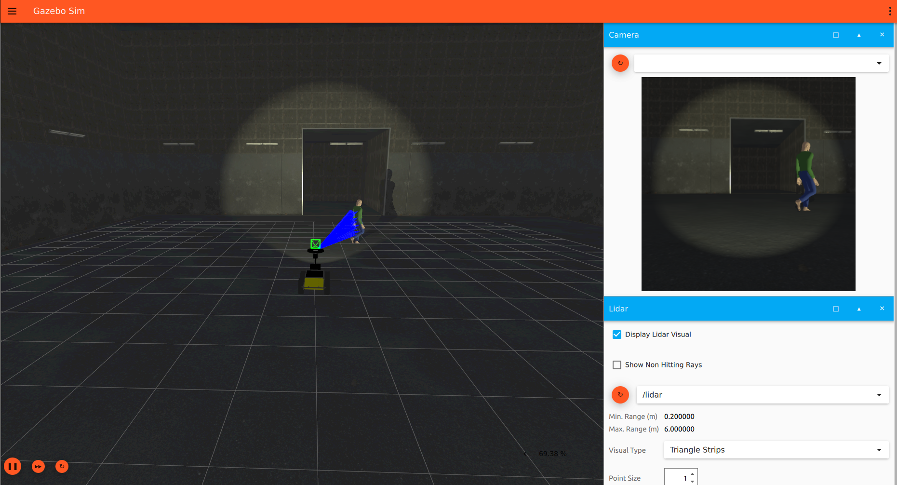
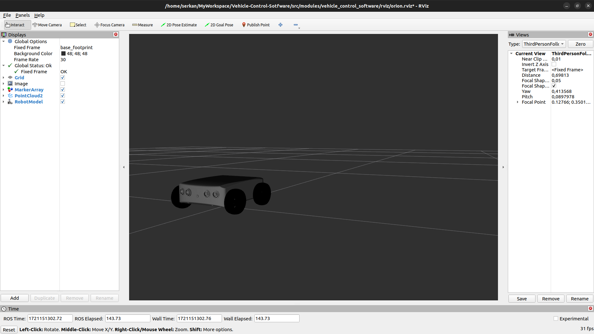

# Vehicle Control Software


https://github.com/user-attachments/assets/59023c52-a4bc-4c01-aa8e-c8ea53fad5f9


https://github.com/user-attachments/assets/4db96611-4f24-4ac1-9bd6-4becd97b4ef5

This repository contains software written for ground vehicle control. The software is designed to be used both in the Gazebo Harmonic simulation environment and on a real vehicle. The vehicle attempts to avoid obstacles using mounted distance sensors (Lidar). To make the system more realistic, noise has been added to the sensors in the simulation environment. Future versions will include additions for artificial intelligence (AI) and image processing. The project is not finished yet, so keep your repository up to date.

###  ON THE [WIKI](https://github.com/serkanMzlm/Vehicle-Control-Sotfware/wiki) THE PAGE
- **[System Requirements](https://github.com/serkanMzlm/Vehicle-Control-Sotfware/wiki#system-requirements)**
- **[Installation & Compilation](https://github.com/serkanMzlm/Vehicle-Control-Sotfware/wiki/Install)**
- **[Run](https://github.com/serkanMzlm/Vehicle-Control-Sotfware/wiki/Run)**
- **[Packages Info](https://github.com/serkanMzlm/Vehicle-Control-Sotfware/wiki/Packages-Info)**

## Contents 
[Features](https://github.com/serkanMzlm/Vehicle-Control-Sotfware?tab=readme-ov-file#features)

[Features to be Added](https://github.com/serkanMzlm/Vehicle-Control-Sotfware?tab=readme-ov-file#features-to-be-added)

[Control](https://github.com/serkanMzlm/Vehicle-Control-Sotfware?tab=readme-ov-file#control)

[Gazebo Harmonic](https://github.com/serkanMzlm/Vehicle-Control-Sotfware?tab=readme-ov-file#gazebo-harmonic)

[RViz2](https://github.com/serkanMzlm/Vehicle-Control-Sotfware?tab=readme-ov-file#rviz2)

[RQT](https://github.com/serkanMzlm/Vehicle-Control-Sotfware?tab=readme-ov-file#rqt)


---

### Features:
- Obstacle avoidance using a Lidar sensor.
- Adding models to the Gazebo environment using C++.
- Accessing and using packages located in different places.
- Recording camera data and camera calibration
- URDF files for RViz
- For vehicle control, RemoteXY (esp8266 NODEMCU), joystick, and keyboard can be used.

### Features to be Added:
- **Position Keeping:** The IMU sensor mounted on it will ensure that the vehicle remains continuously aware of its position during movement. Additionally, in the event of external disturbances, such as impacts, it will attempt to return to its previous position if its direction changes.
- **Sensor filtering and fusion:** Reducing noise in the sensors and using sensor fusion (EKF) to obtain more accurate results.
- **Control Methods:** One of the control methods such as PID, LQR, or MPC will be added.
- **Configure:** A menuconfig file will be added to facilitate the selection of packages.
- **Parallel Processing:** Threads will be used for parallel operations
- **Path Planning**
- **Motion Planning**
- **Mapping**
- **OpenCV:** Object detection, filtering noise in camera data, and applying masking to camera images
- **AI**

## Control

- The control method is specified in the 'control_unit' variable in the params file to control the vehicle. By default, it is set to keyboard control. If desired, it can also be controlled using a joystick or an ESP8266.
- For more detailed information, you can refer to [this](https://github.com/serkanMzlm/Vehicle-Control-Sotfware/wiki/Run#running-the-packages) page. 

1. Keyboard controls are as follows
2. **Joystick control:** Control is achieved using the left joystick.
3. **ESP8266 control:** Joy data is sent to the computer's serial port via an interface prepared using [RemoteXY](https://remotexy.com/en/).

- Instead of running each code individually, the launch file is executed.
```bash
ros2 launch vehicle_control_software drive_launch.py
```
- If files are to be launched individually, the path to the params file should be provided during the launch.
```bash
ros2 run commander commander_node  --ros-args --params-file /home/${USER}/Vehicle-Control-Sotfware/src/modules/vehicle_control_software/config/params.yml
```

## Gazebo Harmonic 


- Simulation settings can be modified by assigning the topic name lidar for the lidar window to display Lidar data. If it is desired to hide areas where detection is not performed, unchecking the show non-hitting rays option is recommended
- To change the model in Gazebo, it is sufficient to modify the [config](https://github.com/serkanMzlm/Vehicle-Control-Sotfware/blob/main/src/modules/vehicle_control_software/config/params.yaml#L41) file. The [gz_bridge](https://github.com/serkanMzlm/Vehicle-Control-Sotfware/tree/main/src/modules/gz_bridge) ROS2 package enables the dynamic loading of models into the Gazebo environment. (To add the model, it needs to be located in the [models](https://github.com/serkanMzlm/Vehicle-Control-Sotfware/tree/main/Tools/simulation/models) directory.)

**Note:** By default, the world is set to default and the model is set to marble_husky. Obstacle avoidance is implemented accordingly. Other models need to be adjusted, and a Lidar sensor needs to be added.

## RViz2
The Lidar sensor data is visualized in conjunction with the camera at the front of the vehicle, as well as the data from the joystick and the error information from obstacle avoidance.

- The **RED** arrow represents the linear velocity.
- The **GREEN** arrow represents the angular velocity.
- The **BLUE** arrow represents the result vector.


- The Orion model has been imported into RViz using the [URDF file](https://github.com/serkanMzlm/Vehicle-Control-Sotfware/tree/main/src/modules/vehicle_control_software/urdf)
- The fixed frame should be set to base_footprint.




## RQT
Using rqt, we can observe the relationships between packets


