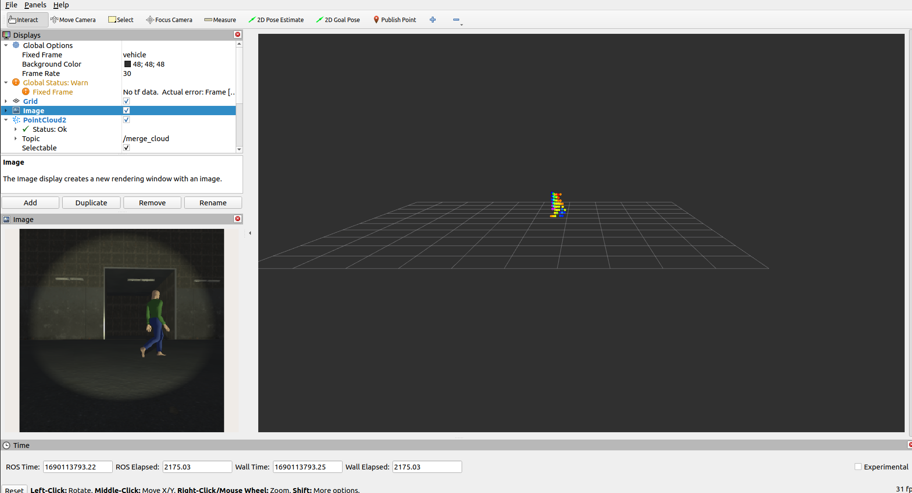
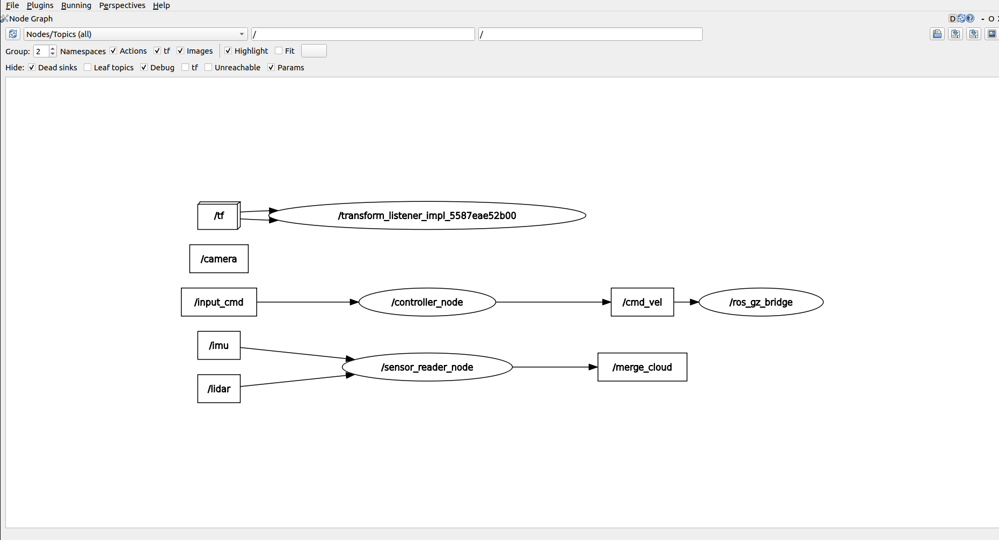

### LAND VEHICLE
___
#### Program Çalıştığı Ortam
- **Ubuntu 22.04**
- **ROS2 Humble**
- **Gazebo Garden**
___
- `command_node` paketi doğrudan klavyeden basılan tuşlara göre `cmd_vel` komutu çalıştırmasını sağlar.
- Sadece bir paketi çalıştırmak istediğimizde ve `RCLCPP_DEBUG` kısımlarının terminalde gözükmesini istersek `--ros-args --log-level [node_name]:=debug` yazılmalıdır. Aynı şekilde ERROR, WARN... içinde aynısı yapılabilir.
```
ros2 run controller  command_node --ros-args --log-level command_node:=debug
```
- `command` klavyede bulunan **ok tuşları** ile hareket ettirilir.

**Not:** `[node_name]:=debug` kısmına node adı yazılmalıdır. Executable dosyanın adı yazılmamalıdır. Örnek kısmında executable ile node adı aynıdır.  

---
### Build
```
git clone git@github.com:serkanMzlm/Land_Vehicle.git

cd Land_Vehicle

colcon build
```

### Run
- Paketler `ros2 run` komutu ile tek tek çalıştırılabiliriz ya da launch dosyasını direkt çalıştırarak bütün paketlerin çalışması sağlanır.
```
source [Land_vehicle_Path]/install/setup.bash

ros2 launch land_vehicle start_launch.py
```
- Klavyede bulunan akfif tuşlar.
```
     W
  A  S  D
     X
```
- `config_file\config\params.yaml` kısmında bulunan `a_scale` ve `l_scale` değişkenleri ile aracın **linear** ve **angular** hızları ayarlanır.

**Not:** `a_scale` ve `l_scale birer katsayıdır. Çok büyük değerler verilmemelidir.

**Not:** Build işlemi `--symlink-install` parametresiyle yapılırsa "params.yaml" dosyasında yapılan değişiklik direkt etki eder. `--symlink-install` komutu src içinde bulunan paketleri install kısmına linklenmesini sağlar. Eğer "params.yaml" dosyasında değişiklik yapılıp build işleminde `--symlink-install` parametresi kullanılmadıysa "land_vehicle" paketi build edilmelidir.
  ```
  colcon build --packages-select land_vehicle
  ```
---
### GZ - RVIZ2 - RQT

#### `Gz Sim`

- `gz sim` simülasyon programında GUI düzenlemelerini `src\land_vehile\worlds\land_vehicle.sdf` dosyasından düzeltilir.
- Lidar mesafeleri GUI üzerinde göstermek için lidar plagin kısmında lidarın adı belirtilmelidir. Ek olarak `Show Non Hitting Rays` kısmı seçilerek sadece algıladığı nesne kısımları görünmesi sağlanır.
- Lidar, kamera, imu gibi araçların ayarlamaları `src\land_vehile\models\marble_husky\model.sdf` dosyası üzerinde oynamalar yapılarak sensörler düzeltilebilir.  

#### `RViz2`

- `Global Options -> Fixed Frame` kısmına `vehicle` yazılmalıdır.
- Image ve PointCloud2 eklemek için `add -> By topic -> Image` ve `add -> By topic -> /merge_cloud` kısımları eklenebilir.
- `PointCloud2` kısmında noktalar daha belirgin ve düzenli olması için alt kısımda bulunan ayarlamalar yapılmalıdır.
```
PointCloud2 -> Selectable = Points
PointCloud2 -> Size(Pixels) = 4
PointCloud2 -> Color Transformer = AxisColor
PointCloud2 -> Axis = X
```
#### `RQT`

- `rqt` uygulamasında paketler arsındaki ilişkiyi görmek için `Plugins -> Node Graph` kısmından incelenebilir.