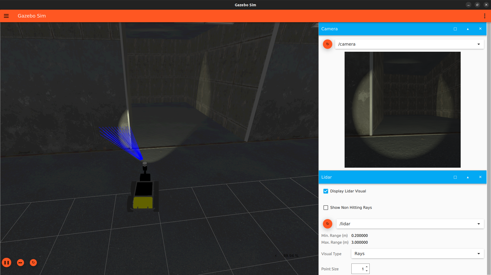

## SAFE DRIVE

### System Requirements
- **Ubuntu 22.04**
- **ROS2 Humble**
- **Gazebo Garden**

### Install
```
cd ~
git clone git@github.com:serkanMzlm/safe-drive.git
```
### Compile
- The path to the model should be added to the GZ_SIM_RESOURCE_PAT environment variable
```
echo "export GZ_VERSION=garden" >> ~/.bashrc

echo "export GZ_SIM_RESOURCE_PATH=/home/${USER}/safe-drive/src/simulation/models" >> ~/.bashrc 

source ~/.bashrc  #or bash or simply restart the terminal
```
- When using the 'bash' command to reload the terminal, it restarts the terminal session, while 'source ~/.bashrc' reloads the .bashrc file, applying the changes for the current session
```
source /opt/ros/humble/setup.bash

cd ~/safe-drive

#Builds all files in the project.
colcon build  

#Or only build a specific package.
colcon build --packages-select [package_name]
```
### Run
```
source /opt/ros/humble/setup.bash
source ~/safe-drive/install/setup.bash
```
- To avoid entering the `~/safe-drive/install/setup.bash` command every time a new terminal is opened, these commands are written to the `~/.bashrc` file.
```
echo "source /opt/ros/humble/setup.bash" >> ~/.bashrc
echo "source /home/${USER}/safe-drive/install/setup.bash" >> ~/.bashrc
```
- The control method is specified in the 'control_unit' variable in the params file to control the vehicle. By default, it is set to keyboard control. If desired, it can also be controlled using a joystick or an ESP8266

1. **Keyboard controls are as follows:**
    - 'w' for forward
    - 's' to stop
    - 'x' for backward
    - 'a' for left
    - 'd' for right

```
    w
a   s    d
    x
```
2. **Joystick control:** Control is achieved using the left joystick.
3. **ESP8266 control:** Joy data is sent to the computer's serial port via an interface prepared using [RemoteXY](https://remotexy.com/en/).
    - To connect to the ESP8266 board, it is necessary to write the port to which the board is connected in the `device_name` variable in the params file. By default, it is `/dev/ttyUSB0`
    - The RemoteXY application is downloaded to the phone, and to connect to the access point broadcasted by ESP8266, you connect to `joy` in the Wi-Fi section. The password is `safe_drive`.


- Instead of running each code individually, the launch file is executed.
```
ros2 launch simulation start_launch.py
```
- If files are to be launched individually, the path to the params file should be provided during the launch.
```
ros2 run controller controller_node --ros-args --params-file /home/${USER}/safe-drive/src/simulation/config/params.yaml
```
### Project
The project aims to create a semi-autonomous ground vehicle capable of navigating its environment and avoiding obstacles. The robot will use sensors such as Lidar. In the later stages, it will maintain its direction with the help of an IMU (Inertial Measurement Unit).
- **Gazebo Garden:** Simulation settings can be modified by assigning the topic name `lidar` for the `lidar` window to display Lidar data. If it is desired to hide areas where detection is not performed, unchecking the `show non-hitting` rays option is recommended



- **Rviz2:** The Lidar sensor data is visualized in conjunction with the camera at the front of the vehicle, as well as the data from the joystick and the error information from obstacle avoidance.
    - The **RED** arrow represents the linear velocity.
    - The **GREEN** arrow represents the angular velocity.
    - The **BLUE** arrow represents the result vector.

- **RQT:** 


### Result